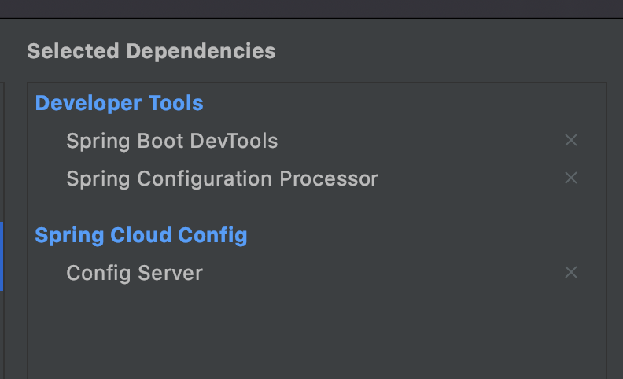

Spring initializr로 프로젝트를 생성합니다.

Developer Tools에서 Spring Boot DevTools, Spring Configuration Processor를 선택합니다.

Spring Cloug Config에선 Config Server를 선택합니다.



그 다음 Config-Server로 지정할 annotation을 입력합니다.

```java
@SpringBootApplication
@EnableConfigServer <-- 이 부분입니다.
public class ConfigApplication {

  public static void main(String[] args) {
    SpringApplication.run(ConfigApplication.class, args);
  }

}
```

저는 application과 bootstrap을 yaml파일을 사용 할 겁니다.

bootstrap.yml

```yaml
encrypt:
  key: hello # temporary encrypt key
spring:
  cloud:
    config:
      server:
        encrypt:
          enabled: false # 암호문 복호화 하지않고 돌려줌 (보안)
```

application.yml

```yaml
spring:
  profiles:
    active: native
server:
  port: 8888

---
spring:
  profiles: native
  cloud:
    config:
      server:
        native:
          search-locations:
            - ${user.home}/Documents/Development/config-repo/account
            - ${user.home}/Documents/Development/config-repo/board
```

여기서는 깃 저장소 연동이 아닌 로컬 경로에 저장된 application.yml을 가져옵니다.

search-locations를 여러개 적으면 각 디렉토리 별 환경설정 파일을 가져올 수 있습니다.

config-server가 구동이 되면 8888포트로 <http://localhost:8888/{application-name}/{profiles>} 요청을 받습니다.

요청을 보낸 서비스는 경로 상에 존재하는 파일을 보내줍니다.

다음에는 환경설정 파일들이 존재하는 폴더를 설명하겠습니다. <-- config-repo가 될 폴더입니다.
