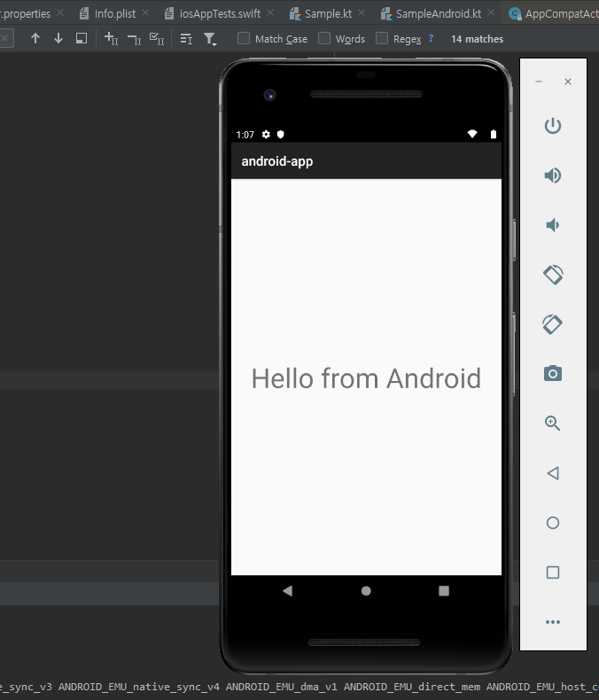

며칠전에 poroject를 생성해놓고 에러를 뿜뿜했던 multi-platform android, ios with kotlin를 드디어 실행시켰다.

나는 이 글을 보고 따라하는데 최신 버전과
[이 예제](<[https://link](https://medium.com/@cafonsomota/set-up-your-first-kotlin-multiplatform-project-for-android-and-ios-e54c2b6574e7)>)와 조금 다른게 있어서 헷갈렸다.

```grooby
1. Select “Use auto-import”은 꼭 해줘야 나처럼 고생은 안할것같다.
현재 Automatically import this project on changes in build script files와 같아보인다.
```

---

먼저 나는 프로젝트 명만 고민하고 별 생각없이 기존 옵션대로 프로젝트를 생성시키고  
gradle이 알아서 import를 하다가 에러를 무지막지하게 쏟아내서 정신 없었다.  
사이트에 나와있던 에러인 sdk_path 설정이 안잡혀서 그런가싶었는데 설정 후에도 gradle에러가 나서 무슨 문제인가 감이 안잡혔다.  
sdk는 intelliJ에서도 다운로드 할 수 있는것 같았는데 구글링하다보니 안드로이드 스튜디오를 설치하면서 같이 설치가 되는거라 안드로이드 스튜디오도 받았다.  
기존에 익숙했던 **java + maven + eclipse**가 아닌 **intelliJ + kotlin + gradle**이여서 당황했었다.  
새벽 한 시가 넘어가서 생성만 해놓고 찝찝한 마음으로 지내다 이틀 뒤인 오늘 다시 한번 도전했다.

```grooby
intelliJ는 역시 짱이었다.
오른쪽 하단에 뜨던 알람 중에 gradle enable auto import를 승락하니 에러가 사라졌다.
```

```grooby
차근차근 진행하는 와중에 Compile target: android 라는 단계를 하고있었는데
Going to "Add Configuration..." 이라는 곳은 현재 버전엔 없었다.
```

구글링한 결과 상단 메뉴 중 RUN -> edit configuration을 들어가서 해야하는 메뉴였다.

RUN 설정을 끝낸 후에 실행을 하니 어라라?  
No target device found이라는 오류가 나왔고 구글링해봐도 별다른 내용을 찾지 못했다.  
그러던 와중에 오른쪽 상단에 run 오른쪽에 device 설정을 하는 곳이 있었고


이미지에 보이는 Pixel 2 API 29위치에서 가상장치를 추가시켰다.  
단말기 하나를 고르고 최신버전의 aos을 다운받고 적용시킨 후
실행을 시켰다.



## 이제 다시 시작이다
