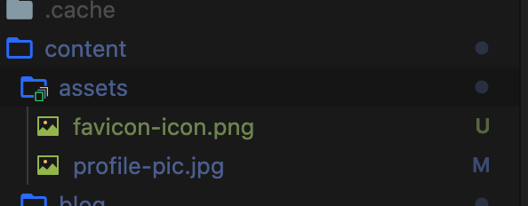

Gatsbyjs로 블로그 만들기가 유행인 느낌이다.

비록 React를 실무수준으로 다루지는 않지만, 구글신과 함께라면 못 만들 이유가 없다.

먼저 [Gatsby.js Tutorials](https://www.gatsbyjs.com/tutorial/)에서 간단하게 배운다.(시간을 갖고 배우자!)

그 다음 [Gatsby starter blog](https://www.gatsbyjs.com/starters/gatsbyjs/gatsby-starter-blog)을 설치해 기본 포맷을 구성합니다.

저는 기존 형식보다는 제 나름대로 변경하고 싶어 Layout과 추가 기능을 구현하려고 했습니다.

content/assets/ 폴더에 제 사진과 원하는 favicon 이미지로 교체합니다.



gatsby-starter-blog가 Typography를 사용하고 있어서 Theme을 바꾸러 [Typography.js](http://kyleamathews.github.io/typography.js/)로 들어가 Github로 변경했습니다.

gihub theme을 설치합니다.

```node
npm install --save typography typography-theme-github
```

그 다음 typography.js를 수정합니다.

```javascript
src / utils / typography.js

import Typography from "typography"
import githubTheme from "typography-theme-github"

const typography = new Typography(githubTheme)

// Hot reload typography in development.
if (process.env.NODE_ENV !== `production`) {
  typography.injectStyles()
}

export default typography
export const rhythm = typography.rhythm
export const scale = typography.scale
```

그러면 화면이 짠✨하고 멋지게 바뀌진 않고 css만 살짝 바뀝니다.

tags

[tags](https://www.gatsbyjs.com/docs/adding-tags-and-categories-to-blog-posts/#reach-skip-nav)를 참조하여 기본 tag들을 만들어 줍니다.

아래는 tags를 보여줄 페이지 작성

naviagtion을 보여주기 위해선 한국 사용자에게 익숙한 왼쪽으로 보여주려고 합니다.

햄버거 버튼을 header 왼쪽 상단에 만들어 이벤트를 추가합니다.

dark mode

[Drak mode example](https://www.gatsbyjs.com/blog/2019-01-31-using-react-context-api-with-gatsby/#adding-the-switch-in-the-header)
[ThemeToggler](ThemeToggler)
