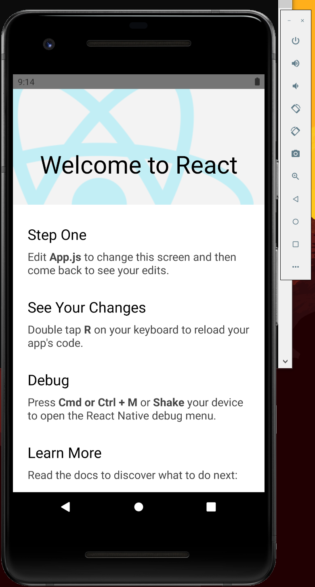

나는 React Native보다 Flutter를 더 좋아한다.

그러나 둘의 개념은 비슷하고 Flutter가 늦게 나왔기 때문에 React와 React Native를 참고했다고 한다.

React로 블로그를 만들다 보니 React Native쪽도 흥미가 생겼고 오래전에 받은 *빠른 모바일 앱 개발을 위한 React Native*책을 읽어보려고 마음 먹었다.

Flutter만 알기에는 너무 모르고 살고 같기도 했다.

책에서는 Mac OS를 기준으로 설명하는데 집에 있는 컴퓨터는 Windows 10이라 brew를 사용할 수 없었다.

Expo 방식은 너무 쉽지만 이미 Android Studio는 설치되어있어서 React Native CLI Quickstart로 진행하려고 한다.

[React Native 환경 설정 방법](https://reactnative.dev/docs/environment-setup)을 참고하여 설치하자.

1. Windows 키를 눌러 시스템 환경 변수 편집을 검색하고 열자.
2. 사용자 변수 밑에 시스템 변수에 새로 만들기 버튼을 누른다. (사용자 변수로 해도 된다.)
3. 변수 이름에 ANDROID_HOME을 적고, 변수 값은 Android Studio File -> Settings 검색 항목에 SDK를 치면 Andoird SDK 메뉴로 온다.
4. Android SDK Location을 복사해 변수 값에 붙여넣는다.
5. 변수 중에 Path를 편집 버튼을 누르고 새로 만들기에 *%ANDROID_HOME%\platform-tools*를 넣어준다.

이 과정을 거치고 npx를 통해 프로젝트를 생성한다.

```javascript
npx react-native init AwesomeProject
```

그 다음 호기롭게 아래 커맨드를 실행했지만 실패했다.

```javascript
npx react-native run-android
```

emulator 관련 에러가 나서 환경 변수 중 Path에 *%ANDROID_HOME%\emulator*를 넣어줬다.

처음에는 에러가 나서 역시 안되나 하고 다시 한번 해보니 이번에는 화면이 떳다.

```javascript
npx react-native run-android
```



근데 React Native는 실행하면 CMD 창이 두 개나 뜬다.

하나는 개발 툴 터미널에서 아래 명령어로 해결할 수 있지만 하나는 무조건 뜨는 것 같다..(Flutter와 달리 깔끔하지 않네 ㅜㅜ)

```javascript
npx react-native start
```

이제 책 예제를 따라하며 배워보자!
