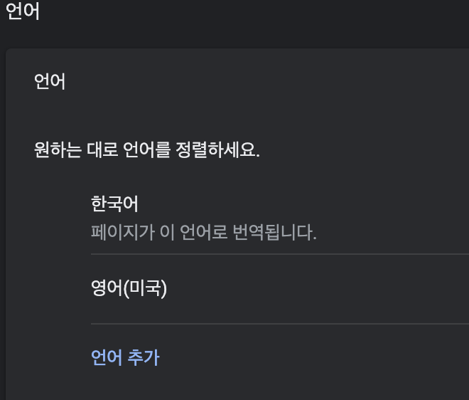

다국어 서비스를 준비하면서 영어와 중국어를 추가해 지역별로 외국에서 접속했을 경우 해당 지역 언어로 나오게 하고싶었다.

Javascript navigator.languages를 사용해 ko-KR을 얻어왔지만 내 PC에서 en-US를 받아오려면 VPN을 사용해야하나 싶었다.

VPN을 확장 프로그램으로 설치하고 사용해도 언어가 변경되지 않았다..

AWS S3와 Cloudfront를 사용해 올렸기 때문에 혹시 여기서 지정해야 변경되는건가 싶었지만

방법은 간단하게도 크롬을 사용하신다면  
설정 - 고급 - 언어로 들어가 영어의 우선순위를 올리면  
**페이지가 이 언어로 번역됩니다**라고 뜨는 언어로 값을 가지고 올 것이다.

이제 사이트를 접속하면 언어가 바뀌어 있다.
