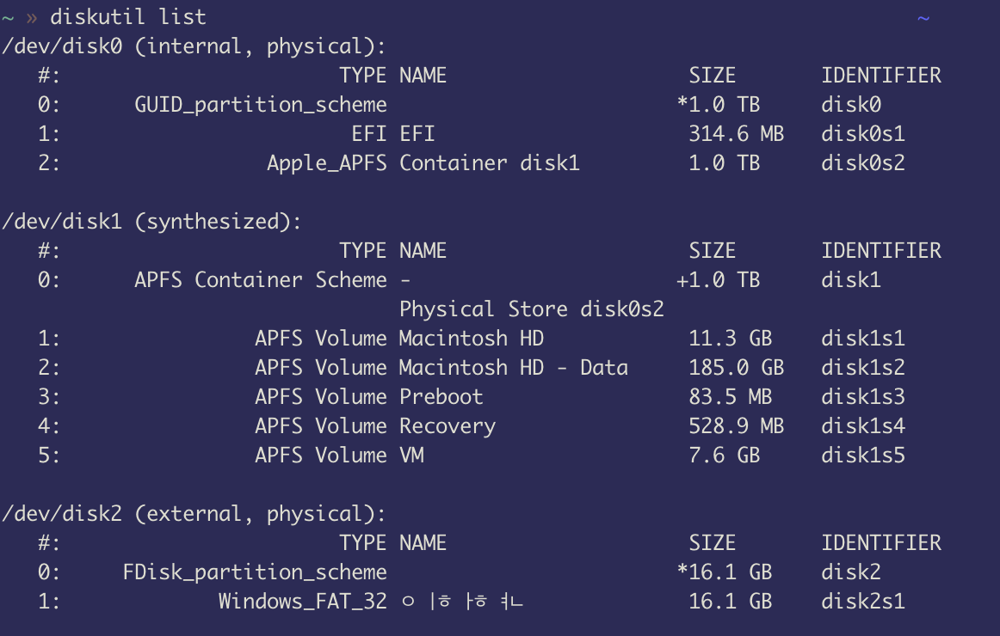
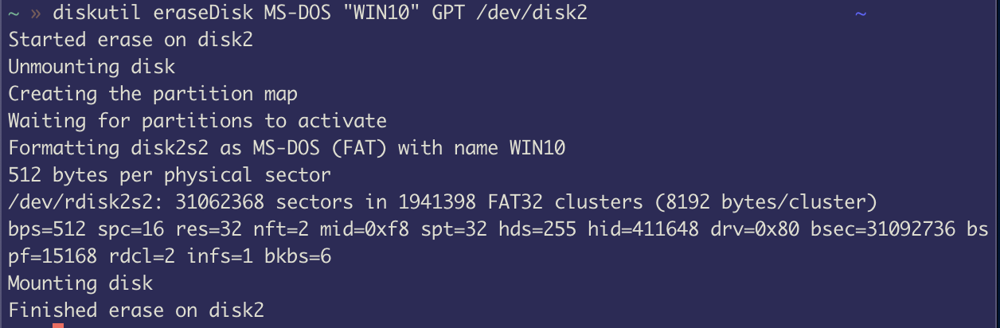

# 맥에서 윈도우10 USB 만들기

**윈도우에서 하세요. 맥은 너무 오래걸리네요..**

회사 윈도우 컴퓨터 중 한 대로 개발환경을 세팅하고 있는데

컴퓨터는 Lenovo region 노트북이었고 이 노트북이 추천하는 Lenovo vantage를 마이크로소프트 스토어에서 받았다(왜 받았을까..).

BIOS 업데이트를 해야한다고 설치하라길래 했는데 벽돌이 되었다?

Lenovo 고객센터에 전화를 하니 가끔 그런다고 특수한 케이스라고 한다.

자동 복구 모드에서 이 PC 초기화도 알 수 없이 에러가 나서 윈도우 초기화 USB를 만들어야 했다.

윈도우에서는 만들기 참 쉽지만, 맥 GUI 환경에선 5G 이상? 또는 파일 크기가 큰 파일은 USB에 담을 수 없다고 합니다.

구글링을 통해 방법을 찾았습니다.

터미널을 이용한다면 맥에서도 할 수 있다는 글을 봤다! 영어가 자신있다면 여기를 보세요! -> [원문](https://www.freecodecamp.org/news/how-make-a-windows-10-usb-using-your-mac-build-a-bootable-iso-from-your-macs-terminal/)

1. Windows 10 ISO 파일을 다운받습니다.

    [여기](https://www.microsoft.com/en-gb/software-download/windows10ISO)를 들어가서 알맞은 윈도우10 ISO 파일을 다운받습니다.

    대략 크기는 5.4G였습니다.

2. USB 장치를 맥에 꽂습니다.

    저는 인터페이스 기기가 있어 USB를 쉽게 꽂았지만 맥은 보통 Type-C여서 USB를 꽂는거부터가 일입니다.

    없으시다면, 집에 적당히 굴러다니는 윈도우 PC를 이용하시거나 PC방을 가야합니다 ㅜㅜ

3. 터미널을 열어 USB가 연결됬는지 확인합니다.

    comman + space를 통해 iterm 또는 terminal을 열고 `diskutil list` 명령어를 실행합니다.

    

    그러면 제일 아래에 아마도 컴바컴이지만, 대부분은 /dev/disk2 (external, physical): 이렇게 표시될 것입니다.

    포맷할때 저 위치를 포맷 할 겁니다.

4. USB 장치를 초기화 합니다.

   윈도우10 USB용으로 사용하기 전에 USB를 포맷시켜 저장공간을 확보합니다.

   혹시 다른 파일들이 있는 경우, 미리 백업하지 않으면 윈도우 USB가 되고나선 접근하지 못할 수 도 있습니다.(예전에 그랬던 기억이..)

   명령어 마지막에 **꼭 자신의 USB 위치**를 입력해주세요. 이 USB WIN10이라는 장치로 이름이 변경되있을겁니다.

   `diskutil eraseDisk MS-DOS "WIN10" GPT /dev/disk2`

    그럼 아래와 같은 화면을 보게될 것입니다.

   

5. hdituil 명령어를 사용해 전송할 준비를 합시다.

    1번 단계에서 다운받은 ISO 이미지를 드디어 사용할때가 됬습니다.

    저는 `~/Downloads` 폴더에 `Win10_20H2_v2_Korean_x64.iso`가 있습니다.

    아래 명령어를 실행해 마운트합니다.

    `hdiutil mount ~/Downloads/Win10_20H2_v2_Korean_x64.iso`

    

6. Windows 10 ISO를 USB에 복사합니다.

    아래 명령어를 실행합니다. 조금 오래 걸려요..

    `rsync -vha --exclude=sources/install.wim /Volumes/CCCOMA_X64FRE_KO-KR_DV9/* /Volumes/WIN10`

    혹시 언어나 받은게 다르다면 명령어가 안될 수 도 있습니다.

    그런 경우 /Volumes에 연결된 정보를 보려면 iTerm의 경우 `/Volumes/`(/뒤부터는 지워있어야 될거에요) tab을 누르면 알 수 있습니다.

    그 다음은 Homebrew가 설치되어 있어야합니다.

    해당 사이트를 방문하여 설치하세요. [Homebrew 설치 방법 링크](https://brew.sh/index_ko)

    `brew install wimlib`를 통해 설치합니다.(이것도 조금 걸리네요..) 저만 그런지 모르겠지만 다른 패키지도 엄청 설치가됩니다..(뭐지..?)

    다 되셨다면 WIN10 안에 sources 폴더를 만들어 줍니다. (저는 이미 존재하는 파일이라고 하네요)

    `mkdir /Volumes/WIN10/sources`

    이제 마지막 명령어를 통해 다운받은 이미지가 USB 폴더 내로 보내집니다. (10분 정도 걸려요)

    `wimlib-imagex split /Volumes/CCCOMA_X64FRE_KO-KR_DV9/sources/install.wim /Volumes/WIN10/sources/install.swm 3800`

7. 이제 윈도우 PC에 USB를 꽂아서 사용합시다!

    6단계가 의외로 까는게 많아서 뭔가 불만이네요. 오래 걸리기도 하구요ㅠㅠ

    윈도우 PC가 있다면 윈도우를 통해 하는 게 제일 깔끔한거 같습니다.

    그래도 맥에서 해본다는게 좋은 경험이었던 같아요.
