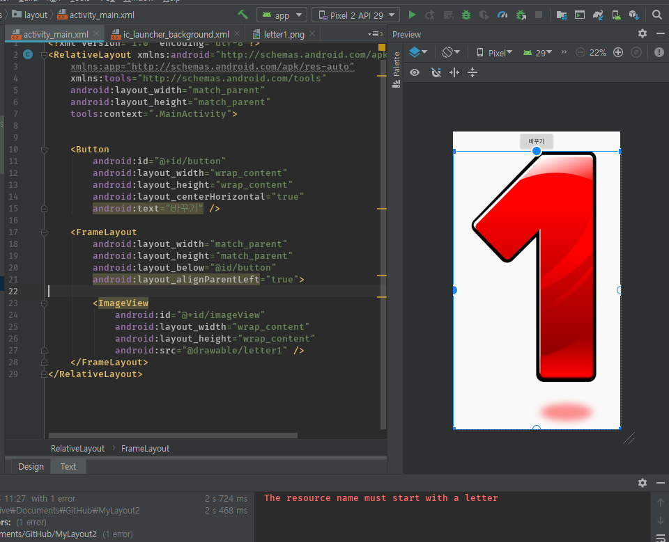

퇴근하고 나서 집에서 안드로이드 예제 책을 보면서 공부중이였는데
버튼 누를 때 마다 이미지가 바뀌는 기능이었다.  
이미지 3개를 drawable 폴더에 1.png, 2.png, 3.png해서 넣어놓고
build를 했는데 자꾸 에러가 나기에 뭔가 봤더니 파일명이 숫자로 시작하게되면 빌드 시에 에러가 나는 거였다.

파일명을 수정하고 build 후 실행됬다.
