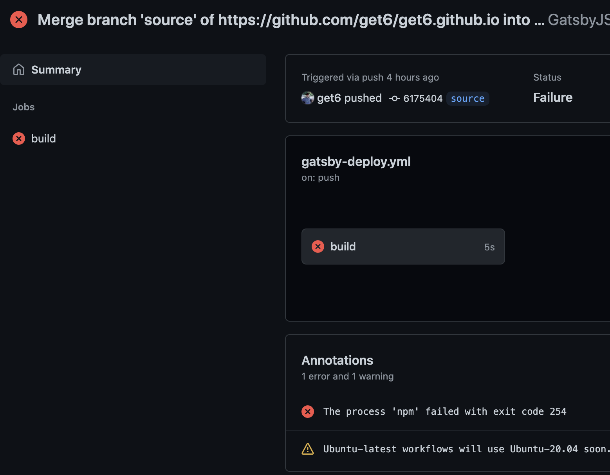

블로그 source 브랜치를 깃허브에 push하면 자동적으로 master 브랜치에 deploy하려고 했는데 이게 매번 실패했다.

나는 가끔 글을 쓰고 수동으로 배포 작업을했는데 어느날, 메일에 CI 작업이 실패했다고 와서 알게됬다.

한동안은 블로그를 typescript로 바꾸느라 애먹고 있었는데 이번에 error를 다 없앤김에 이 오류도 해결하기로 마음 먹었다.

가장 최근에 오류는 이것이다.



문제는 `The process 'npm' failed with exit code 254` 이거 같은데 나는 GitHub Actions을 이해하고 쓰지 않았고 예제를 보며해봤기 때문에 이참에

GitHub Actions 가이드 문서를 보기로 했다. -> [Introduction to GitHub Actions](https://docs.github.com/en/actions/learn-github-actions/introduction-to-github-actions) 과 [Building and Testing NodeJS](https://docs.github.com/en/actions/guides/building-and-testing-nodejs)

나는 이 사람이 만든 [Action](https://github.com/enriikke/gatsby-gh-pages-action)을 이용했고, 기존 코드를 수정할 필요가 있었다.

기존 코드는 아래와 같다.

```yaml
# This workflow will do a clean install of node dependencies, build the source code and run tests across different versions of node
# For more information see: https://help.github.com/actions/language-and-framework-guides/using-nodejs-with-github-actions

name: GatsbyJS Deploy

on:
  push:
    branches: [ source ]

jobs:
  build:
    runs-on: ubuntu-latest
    steps:
    - name: Gatsby Publish
      uses: enriikke/gatsby-gh-pages-action@v2.1.1
      with:
        # A personal access token needed to push your site after it has been built.
        access-token: ${{ secrets.GATSBY_PUBLISH_ACCESS_TOKEN }}
        # The branch expected by GitHub to have the static files needed for your site.
        deploy-branch: master # optional, default is master
        # Additional arguments that get passed to `gatsby build`.
        gatsby-args: gh-pages -d public # optional, default i
```

수정을 몇번 해보면서 테스트 해보니 ```every step must define a `uses` or `run` key```라는 오류가 떴었다.

```yaml
- uses: actions/checkout@v2
- name: Gatsby Publish
- uses: enriikke/gatsby-gh-pages-action@v2.1.1
```

원인은 name 다음에는 해당 하나의 uses만 있어야 하는데 배열 선언 방식으로 해서 그런거 같다.\
해결 방법은 아래처럼 하면된다.

```yaml
- uses: actions/checkout@v2
- name: Gatsby Publish
  uses: enriikke/gatsby-gh-pages-action@v2.1.1
```

또 이런 에러도 났었다. `The process 'git' failed with exit code 128`
이건 내가 GATSBY_PUBLISH_ACCESS_TOKEN을 잘 못 넣었다.\
GitHub.com -> Settings -> Developer settings -> Personal access tokens -> Generate new token을 누르고 원하는 이름으로 발급된 토큰값을 복사한다.\
그 다음 블로그 Repository로 간 다음, Setting -> Secrets에 원하는 이름을 넣고(내 경우는 GATSBY_PUBLISH_ACCESS_TOKEN) 거기에 아까 만든 토큰값을 붙여 넣는다.

배포에 사용되는 코드는 다음과 같다.

```yaml
name: GatsbyJS Deploy
on:
  push:
    branches:
      - source
jobs:
  build:
    runs-on: ubuntu-latest
    steps:
      - uses: actions/checkout@v2
      - name: Gatsby Publish
        uses: enriikke/gatsby-gh-pages-action@v2.1.1
        with:
          # A personal access token needed to push your site after it has been built.
          access-token: ${{ secrets.GATSBY_PUBLISH_ACCESS_TOKEN }}
          gatsby-args: --verbose
          
```
