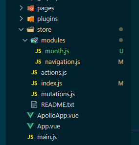

Vuex에선 createNamespacedHelpers 객체를 제공한다.  
이 store를 이용해 각 component에서 편하게 사용하기 위해 적용해봤다.  
아직도 적응중이지만 각 components끼리 data, event 전달하는것만큼 머리를 싸맬 필요는 없어서 좋아보였다.

만일 `import { createNamespacedHelpers } from "vuex";`를 이용하려면 먼저 store/index.js를 만들어야 한다.



폴더 구조는 이런식으로 하고 아래는 index.js 내용이다.

```javascript
import Vue from "vue";
import Vuex from "vuex";
import navigation from "@/store/modules/navigation";
import createLogger from "vuex/dist/logger";

Vue.use(Vuex);

const debug = process.env.NODE_ENV !== "production";

export default new Vuex.Store({
  modules: {
    navigation
  },
  strict: debug,
  plugins: debug ? [createLogger()] : []
});
```

이제 사용할 준비가 됬다. 아래는 AppHeader.vue 내용이다.

```javascript
<template>
  <v-app-bar app color="cyan" dark>
    <!-- <v-app-bar-nav-icon @click.stop="openDrawer = !openDrawer" /> -->
    <v-app-bar-nav-icon @click.stop="clickDrawer" />
    <v-toolbar-title>Daisy</v-toolbar-title>
  </v-app-bar>
</template>

<script>
import { createNamespacedHelpers } from "vuex";

const navigationHelper = createNamespacedHelpers("navigation");

export default {
  name: "AppHeader",
  computed: {
    // 1번
    ...navigationHelper.mapState(["openDrawer"]) // 사용가능

    // 2번
    ...navigationHelper.mapState({ // vue devtools에서 error during evaluation 발생
      openDrawer: state => state.navigation.openDrawer
    })
  },
  methods: {
    ...navigationHelper.mapActions(["clickDrawer"])
  }
};
</script>
```

mapState에는 몇가지 형식이 있는거같은데 위에 처럼 사용해야한다. 뭔가 안되는 이유가 분명히 있을텐데 vue는 debugging이 참 어렵다.

그리고 위에 @click이벤트가 지정된 곳에 주석된 부분은 다음과 같은 에러가 나서 store 이벤트로 변경했다.  
`Computed property "openDrawer” was assigned to but it has no setter`

vuex를 안쓰다가 적용해보려니 template안에서도 신경써야할게 생겨서 새롭다...
